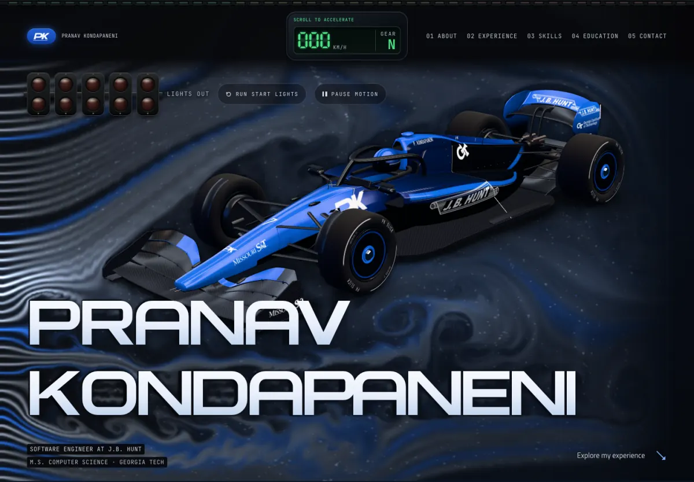

# Pranav Kondapaneni

**Software Engineer at J.B. Hunt · M.S. Computer Science at Georgia Tech**

[Visit the site](https://adamnolle.github.io/Pranav-Website/) · [Connect on LinkedIn](https://www.linkedin.com/in/pranavkondapaneni/)

A personal portfolio built around an interactive race car and a full-page wind tunnel. The site presents Pranav’s experience, skills, education, and contact information in a single responsive page.



## The experience

- **Airflow:** A stream fills the page from the left on each visit. Scrolling changes its pace; moving a mouse pushes the air aside. The tunnel adjusts its detail to the device and connection.
- **Car:** Drag to rotate it with a mouse or finger. On a keyboard, use the arrow keys to turn and **Home** to reset. Vertical touch gestures still scroll the page.
- **Start lights:** Run the five-light sequence from the hero. The speed gauge and shift lights respond to scrolling.
- **Portrait card:** A subtle foil effect follows mouse movement or a horizontal touch drag.
- **Motion controls:** Pause Motion keeps a still scene, and the site respects the system’s reduced-motion setting.

The page remains readable if 3D rendering is unavailable. A responsive car poster appears first and stays in place if the model cannot load.

## Run locally

The published site is plain HTML, CSS, and JavaScript. Serving it does not require a build step.

```bash
python3 tools/serve.py
# Open http://127.0.0.1:8765/
```

Pass a different port if needed: `python3 tools/serve.py 8767`.

## Check changes

```bash
npm ci
npx playwright install chromium
npm test
```

The browser suite checks responsive layouts, pointer and touch interactions, keyboard controls, motion preferences, loading fallbacks, and common regressions. It writes screenshots and frame samples to the ignored `tests/artifacts/` directory. See [local validation notes](tests/VALIDATION.md) for the measured environment and its limits.

The suite can also use an existing browser and server:

```bash
BROWSER_PATH="/path/to/chromium" BASE_URL="http://127.0.0.1:8765" npm test
```

## How it is built

| Part | Main files |
| --- | --- |
| Content and page structure | [`index.html`](index.html) |
| Layout, typography, and visual details | [`styles.css`](styles.css), [`refinements.css`](refinements.css) |
| Navigation, lights, telemetry, and portrait card | [`main.js`](main.js) |
| Interactive car and 3D scene | [`car.js`](car.js) |
| Fluid flow and particles | [`windtunnel.js`](windtunnel.js) |
| Car asset generation | [`blender/build_car.py`](blender/build_car.py) |
| Browser checks | [`tests/site.cjs`](tests/site.cjs) |

The car renders when it moves and rests when idle or offscreen. The wind tunnel scales its particle count and solver rate for smaller screens and slower connections. Its flow is a visual simulation, not an aerodynamic analysis. Models, textures, scripts, and fonts are served from this repository.

To rebuild the procedural car or the trimmed three.js bundle, use Blender and the project scripts:

```bash
blender --background --python blender/build_car.py -- --no-bake
npm run build:three
```

## Assets and credits

The car and PK monogram are original project assets; the portrait is Pranav’s supplied photograph. Organization marks identify Pranav’s employer and schools. Their owners retain their respective rights. Asset provenance is recorded in [logo sources](assets/logos/SOURCES.md).

The site uses three.js under the MIT license. PK Wide is an original project typeface, generated by [`tools/build_font.py`](tools/build_font.py). Titillium Web and JetBrains Mono are self-hosted under the SIL Open Font License; their license files are in [`assets/fonts/`](assets/fonts/).
