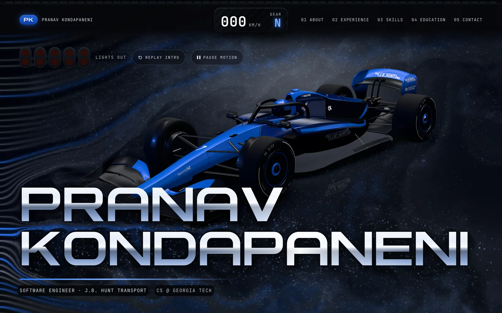
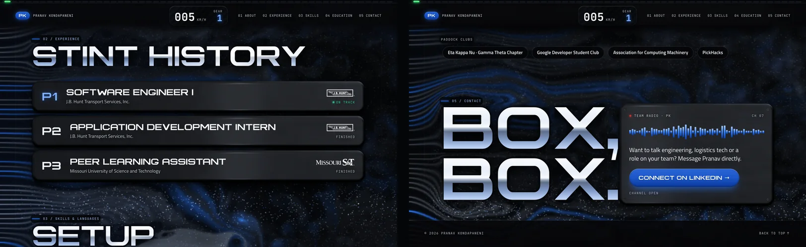
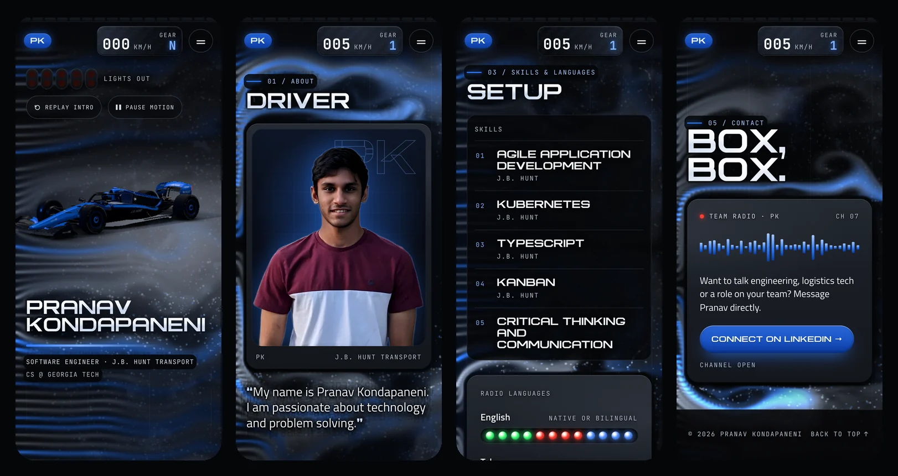
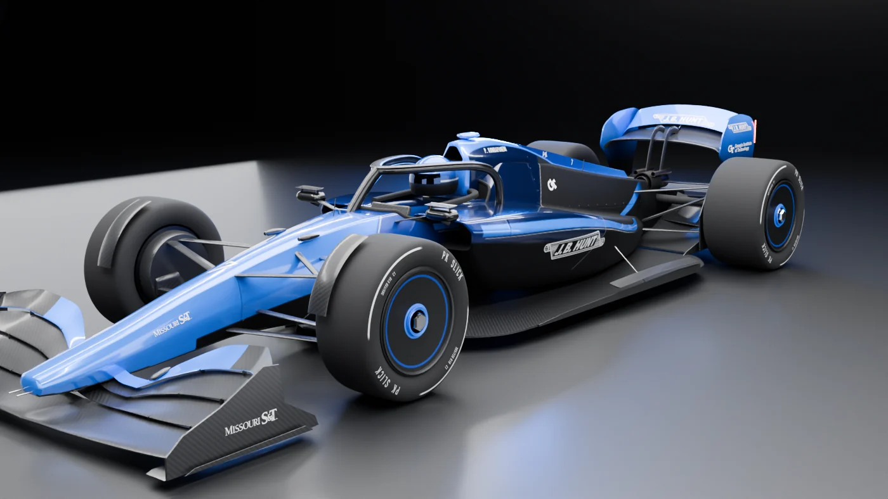

<p align="center">
  <a href="https://adamnolle.github.io/Pranav-Website/">
    
  </a>
</p>

<h1 align="center">Pranav Kondapaneni</h1>

<p align="center">
  <b>Software Engineer at J.B. Hunt Transport · CS at Georgia Tech</b><br>
  A portfolio built like a night session in an F1 wind tunnel.
</p>

<p align="center">
  <a href="https://adamnolle.github.io/Pranav-Website/"><b>🏁 View the live site: adamnolle.github.io/Pranav-Website</b></a>
</p>

<p align="center">
  <a href="https://adamnolle.github.io/Pranav-Website/"></a>
  
  
  
</p>

---

## The idea

A recruiter should know who Pranav is within five seconds and be one click from LinkedIn. Everything else is the fun part:

- **Lights out.** Five red start lights count down, the car rolls in and brakes, and the name flies into place in chrome. Scroll, tap or press a key and the intro lands at once.
- **Wind tunnel.** Real-time smoke and tracer particles (a WebGL2 stable-fluids solver) stream across the whole page and bend around the headlines and the car.
- **The car.** Pranav's own 2024–25-regulation F1 car, modelled procedurally in Blender and lit in a studio with softboxes. It carries his livery, number 7, and the J.B. Hunt, Georgia Tech and Missouri S&T marks.
- **Telemetry.** Your scroll speed drives the speedometer, the gear readout and the shift lights across the top edge.
- **Brushed metal.** The cards are anodised graphite plates rendered live with anisotropic GGX, and their highlight follows your pointer.

<p align="center">
  
</p>

## On a phone

The phone layout frames the car above the name and stacks the stats. It loads a lighter model and smoke atlas and holds 60 fps in the hero.

<p align="center">
  
</p>

## The car

<p align="center">
  
</p>

`blender/build_car.py` builds the car from code, with no hand modelling. It is checked against real 2024–25 dimensions:

| | |
| --- | --- |
| Length × width × height | 5.57 m × 2.02 m × ~0.96 m |
| Wheelbase / tyres | 3.60 m / 720 mm |
| Bodywork | B-spline sections lofted with monotone-cubic stations: taut surfaces with crisp shoulder lines |
| Livery | One baked UV texture set, from an electric-blue nose through gloss navy to a satin-black rear, with a silver pinstripe |
| Sponsors | J.B. Hunt on the sidepods, endplates and DRS flap; Georgia Tech on the engine cover and endplates; Missouri S&T on the nose and front wing. Phones get a wordmark-only J.B. Hunt so it stays crisp at small sizes |
| Web delivery | Draco-compressed GLB with WebP textures (`car.glb` ≈ 1.5 MB; `car_mobile.glb` ≈ 1.0 MB, decimated for phones) |

## Accessibility and the Apple Human Interface Guidelines

The site targets **WCAG 2.2 AA** and follows Apple's [Human Interface Guidelines](https://developer.apple.com/design/human-interface-guidelines). It respects the settings people already chose on their devices.

| Setting or guideline | What the site does |
| --- | --- |
| **Larger Text / Dynamic Type** | Reading text is sized in `rem`; on iPhone and iPad, the root size follows the system text size. Display headings grow only until their longest word fills the column, so nothing clips at 200%. |
| **Reduce Motion** | The car is parked, the smoke is a still frame, and reveals, hover movement and pulsing lights are off. |
| **Pause Motion** | A persistent button stops the smoke, the car and every looping animation, and it's remembered across visits. |
| **Increase Contrast** | Secondary text turns near-white, hairlines become real edges, backings go opaque and the smoke dims. |
| **Reduce Transparency** | The bars and chips go fully opaque. |
| **Controls** | Every control is at least 44 × 44 pt, has a press state and a visible focus ring, and uses a verb label ("Replay Intro", "Connect on LinkedIn"). Content that isn't interactive never looks tappable. |
| **Layout** | The nav uses a scroll edge effect instead of a hard-edged bar. Margins respect the notch and home-indicator safe areas, and the layout holds from 320 pt to ultrawide. |
| **Screen readers** | Semantic landmarks, a skip link, real headings and lists, decorative canvases hidden, and a keyboard-operable menu that closes with Esc. |
| **Contrast over the smoke** | Every text element was measured against the live smoke at every scroll position: all ≥ 4.5:1, worst case 5.5:1. |

## Performance

Measured on a 2× retina desktop and on a 3× phone with 4× CPU throttling:

- Hero at **60 fps** on phones and ~56 fps on a retina desktop; scrolled sections hold 60 fps.
- **LCP ≈ 0.7 s** on a throttled phone, **CLS 0.006**. The name's silhouette paints on the first frame.
- The three WebGL layers start in stages after first paint; the car stops rendering when scrolled away, and the smoke and metal idle in background tabs.

## Run it locally

```bash
python3 tools/serve.py        # → http://127.0.0.1:8765/
```

It's plain HTML, CSS and ES modules, so there's nothing to install. (`python3 -m http.server` works too, but it drops some of the parallel texture requests.)

## How it's built

| Part | Source |
| --- | --- |
| Page, layout, accessibility | `index.html`, `styles.css`, `main.js` |
| 3D car in the hero (three.js) | `car.js` ← `assets/car.glb`, built by `blender/build_car.py` |
| Wind-tunnel smoke and tracers (WebGL2 stable fluids) | `windtunnel.js` ← sprites from `blender/build_smoke.py` |
| Brushed-metal plates (WebGL, anisotropic GGX) | `metal.js` ← textures from `blender/build_metal.py` |
| PK Wide, the display typeface | `assets/fonts/pk-wide*.woff2`, drawn in code by `tools/build_font.py` |
| Design contract and backlog | `DESIGN.md`, `BACKLOG.md` |

<details>
<summary><b>Rebuilding the assets</b></summary>

<br>

The assets are built with Blender 5.2, from the repo root:

```bash
# car: exports assets/car.glb + assets/car_mobile.glb, bakes the contact shadow,
# and optionally renders Cycles previews to blender/preview_<view>.png
blender --background --python blender/build_car.py -- --render 3q side rear
blender --background --python blender/build_car.py -- --no-bake     # skip the shadow bake

blender --background --python blender/build_metal.py   # metal plate textures
blender -b --factory-startup -P blender/build_smoke.py   # smoke sprite atlas

pip install fonttools brotli
python3 tools/build_font.py                             # PK Wide (regular + italic)
```

</details>

<details>
<summary><b>Using the official Formula1 fonts</b></summary>

<br>

The site ships with **PK Wide**, an original extended display face drawn for this project. If you have the Formula1 font ZIP, you can swap it in:

```bash
pip install fonttools brotli
python3 tools/install_f1_fonts.py path/to/fonts.zip
```

This writes `assets/fonts/*.woff2` and `assets/fonts/f1.css`. The Formula1 typefaces belong to Formula One Licensing B.V., so check the licence before publishing with them.

</details>

## Credits

- **Photo** © Pranav Kondapaneni. It was upscaled 4× with Real-ESRGAN and cut out with BiRefNet-portrait.
- **Logos** are the trademarks of their owners and identify Pranav's employer and schools. Sources are listed in [`assets/logos/SOURCES.md`](assets/logos/SOURCES.md).
- **Car, smoke, metal and typeface** are original to this site.
- Built with [three.js](https://threejs.org) and [Blender](https://www.blender.org).

<p align="center">
  <br>
  <a href="https://adamnolle.github.io/Pranav-Website/"><b>adamnolle.github.io/Pranav-Website</b></a> ·
  <a href="https://www.linkedin.com/in/pranavkondapaneni/">Connect with Pranav on LinkedIn</a>
</p>
